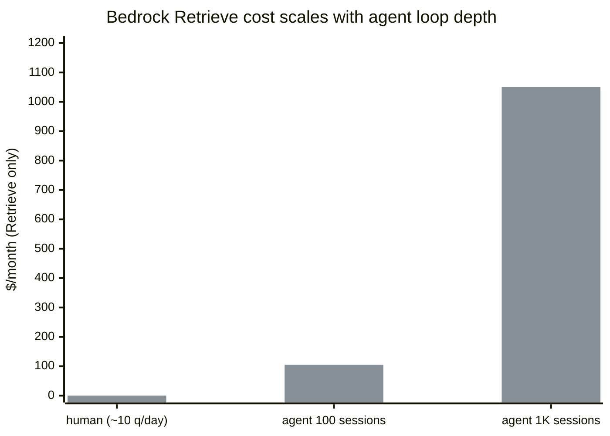

<div align="center">


<h1 align="center">bedrock-tax</h1>
<p align="center"><i>Replacing OpenSearch Serverless with Aurora x pgvector to cut Bedrock Knowledge Base costs from $700/mo → $50/mo</i></p>

[![Github][github]][github-url]

</div>

<br/>

## Table of Contents

<ol>
    <a href="#problem">Problem</a><br/>
    <a href="#hidden-constraint">Hidden constraint</a><br/>
    <a href="#approach">Approach</a><br/>
    <a href="#agent-era-context">Agent-era context</a><br/>
    <a href="#embedding-strategy">Embedding strategy</a><br/>
    <a href="#schema">Schema</a><br/>
    <a href="#query-pattern">Query pattern</a><br/>
    <a href="#repo-structure">Repo structure</a><br/>
    <a href="#stack">Stack</a><br/>
    <a href="#contact">Contact</a>
</ol>

<br/>

## Problem

Our AI agent (used for speeding up oncall triage work) was querying a **AWS Bedrock Knowledge Base** (backed by **AWS OpenSearch Serverless**):
- OpenSearch Serverless requires min **2 OCU** (OpenSearch Compute Units) [quote](https://aws.amazon.com/opensearch-service/pricing/)
- billed at **$350/OCU/month** [quote](https://aws.amazon.com/opensearch-service/pricing/)
- result → a flat **$700/month floor** *regardless of actual query volume*

The KB served **~8,800 documents** across three domains:
- documentation:  **~7,700** chunks
- compliance rules: **~1,100** rules
- code repo metadata: **~5,600** chunks

Realizing the issue:
- AI agent's underlying Bedrock model was Claude 3.5 Haiku (`claude-3-5-haiku-20241022`), which accessed the Knowledge Base thru the `Bedrock Retrieve API` at **$0.00035 per query** [quote](https://aws.amazon.com/bedrock/pricing/)
- at human query volumes this per-query cost was negligible- the $700 floor dominated the bill

But agent traffic is **NOT** human traffic:
- a human triaging a ticket may search the KB **~5 times/hr** → skim results → move on
- the agent doing the same triage blasts the KB **20+ times/5 sec**- every tool call, often further fanning out into parallel crosswalk lookups across docs, security rules, commit history
- a busy oncall week with just **1,000 agent sessions** = **100,000 queries** = **$35/day** in Retrieve fees alone- *on top of the $700 floor(!)*


## Hidden constraint

Bedrock Knowledge Base presents as a single managed service: 
> ingest docs → call `RetrieveCommand` → results

But under the hood, it decomposes into two meters that are actually **decoupled**:

| | Meter | What | Cost ($) | | Alternative |
|---|---|---|---|---|---|
|  | Vector store (backend) | OpenSearch Serverless| $700/mo floor | → | Swap backend (Aurora pgvector), keep interface (`Bedrock Retrieve API`) |
|  | Retrieval interface | `Bedrock Retrieve API` | $0.00035 x query [quote](https://aws.amazon.com/bedrock/pricing/) | → | Query backend (vector store) directly via raw SQL |

**Core insight**: cost floor was attached to the backend (vector store), *not to the retrieval interface*

## Approach

| | Step | Date | Changes | Cost impact | % saved |
|---|------|------|-------------|-------------|---------|
|  | 1 | 2025-12-31 | <ul><li>Swap backend, keep interface</li><li>OpenSearch Serverless → Aurora pgvector</li><li>app still calls `RetrieveCommand`</li></ul> | $700/mo → $50/mo | <span style="color:#16a34a">+93%</span> |
|  | 2 | 2026-01-29 | <ul><li>Drop interface to fully bypass KB</li><li>delete KB</li><li>app embeds via Titan, queries Aurora via RDS Data API</li></ul> | $0.00035/q Retrieve [quote](https://aws.amazon.com/bedrock/pricing/) → $0 Retrieve | <span style="color:#16a34a">+100%</span> |


**Migration path**:
> each step is independent + can be validated before proceeding:

**Step 0**:
- Bedrock KB on OpenSearch Serverless (~$700/mo)
- Agent + S3 docs → `Retrieve API` → OpenSearch


**Step 1**:
- kept Bedrock KB `Retrieve API` intact- same application code, same KB config, different storage backend
- Aurora Serverless v2 runs at **~$50/month** and **scales to zero ACU on idle** [quote](https://docs.aws.amazon.com/AmazonRDS/latest/AuroraUserGuide/aurora-serverless-v2-auto-pause.html)
- the OpenSearch Serverless floor disappeared immediately
- see [`migrations/01_swap_store.sql`](migrations/01_swap_store.sql)


**Step 2**:
- fully deleted Bedrock KB + dropped `RetrieveCommand` from the path
- the application embeds the query using Titan v2 (`amazon.titan-embed-text-v2:0`) → sends embedding as a SQL param → then runs a cosine distance query against Aurora via `ExecuteStatementCommand` (RDS Data API)
- see [`migrations/02_kill_wrapper.sql`](migrations/02_kill_wrapper.sql)


**Figures**:
- one-time embedding cost for all ~8,800 rows: **~$0.20** via Titan v2
- per-query **retrieval** cost after step 2: **$0** (meter gone- you no longer call it)
- left: Titan query embed (**~$0.00002/1K tok**) [quote](https://aws.amazon.com/bedrock/pricing/) + the ~$50/mo Aurora floor

## Agent-era context

Bedrock's `Retrieve API` at $0.00035/query [quote](https://aws.amazon.com/bedrock/pricing/) is priced for human access patterns- a few queries per session, a few sessions per day

Agent traffic operates differently: a single agent session doing RAG against the KB generates retrieval calls at every turn, often multiple per turn:

| Caller | Queries/day | Retrieval cost/day | Retrieval cost/mo |
|--------|-------------|-------------------|-----------------|
| human | ~10 | $0.004 | $0.11 |
| agent (20-turn × 5 KB hits × 100 sessions) | 10,000 | $3.50 | $105 |
| agent (20-turn × 5 KB hits × 1,000 sessions) | 100,000 | $35.00 | $1,050 |



Before step 1, the $700 OpenSearch floor dominated total cost + made the per-query fee invisible
After step 1 eliminated the floor, the per-query cost became primary line item and **scaled with agent loop depth rather than user count**
This is what motivated step 2.

## Embedding strategy

### Model choice

| | Embedding model | Dimensions | Cost/1K tok | Notes |
|---|-------|-----------|-------------------|-------|
|  | **`amazon.titan-embed-text-v2:0`** ✓ | 256 / 512 / 1024 | $0.00002 [quote](https://aws.amazon.com/bedrock/pricing/) | native AWS, no cross-region (chosen ✔️) |
|  | `cohere.embed-english-v3` | 1024 | $0.0001 [quote](https://aws.amazon.com/bedrock/pricing/) | 5× more expensive, better MTEB scores |
|  | `cohere.embed-multilingual-v3` | 1024 | $0.0001 [quote](https://aws.amazon.com/bedrock/pricing/) | multilingual support not needed |

Titan v2 chosen over Cohere for cost:
- at ~8,800 documents the quality difference between Titan and Cohere is negligible for documentation search
- docs are technical English, queries are technical English, and recall difference does not justify 5× embedding cost
- both models available in native Bedrock

**Configuration**:
- Titan v2: **1024 dimensions** (maximum), **normalization enabled** [quote](https://docs.aws.amazon.com/bedrock/latest/userguide/titan-embedding-models.html)
- at <10K vectors, the storage overhead of 1024d vs 512d vs 256d is trivial (~30MB total)
- higher dimensionality provides better recall on semantic search without any meaningful cost to index build time or query latency at this scale

### Chunking

Previous Bedrock KB setup used **hierarchical chunking** (built into its managed ingestion pipeline) [quote](https://docs.aws.amazon.com/bedrock/latest/userguide/kb-chunking.html):

| Parameter | Value |
|-----------|-------|
| strategy | `HIERARCHICAL` |
| level 1 (parent) | 1,500 tokens |
| level 2 (child) | 300 tokens |
| overlap | 60 tokens |

After deleting Bedrock KB (step 2), managed chunking pipeline no longer exists:
 - documents now stored as **pre-chunked units**
 - upstream document preparation process produces chunks *before* they reach embedding stage
 - ingest script caps each chunk at **8,000 characters** (Titan v2 input limit) [quote](https://docs.aws.amazon.com/bedrock/latest/userguide/titan-embedding-models.html) + embeds full chunk as a *single vector*

Tradeoff:
- simpler strategy than hierarchical chunking
- but it shifts chunking responsibility upstream
- for this corpus (documentation pages, rule descriptions, code metadata), the source documents were already naturally segmented into page-sized units, so loss of hierarchical retrieval was not impactful

### What gets embedded vs what doesn't

Not every table has embeddings- decision depends on whether data needs semantic search or whether structured/equality lookups are sufficient:


| Table | Rows | Embedded | FTS | Why |
|-------|-----:|----------|-----|-----|
| `devdocs.chunks` | ~7,700 | ✓ vector(1024) | ✓ tsvector | documentation- needs semantic + keyword search |
| `compliance_rules.rules` | ~1,100 | ✓ vector(1024) | ✓ tsvector | rule descriptions- needs semantic + keyword search |
| `security_rules.owners` | ~120 | ✗ | ✗ | structured metadata- queried by team_id, name (equality) |
| `code_intel.chunks` | ~5,600 | ✓ vector(1024) | ✗ | code context- needs semantic search, not keyword |
| `code_intel.commits` | ~7,900 | ✗ | ✗ | structured- queried by author, date range |
| `code_intel.contributors` | ~900 | ✗ | ✗ | structured- queried by name, email |
| `code_intel.branches` | ~600 | ✗ | ✗ | structured- queried by branch name |

Embedding every row would cost ~$0.50 instead of ~$0.20 and would add no value- you don't semantic-search a branch name or a contributor email
- structured tables use B-tree indexes and `WHERE` equality filters

### Dual-field pattern: vector + tsvector on the same row

Tables that need both semantic + keyword search carry both fields on every row:

```sql
embedding   vector(1024),
searchable  tsvector GENERATED ALWAYS AS (
  to_tsvector('english', coalesce(title, '') || ' ' || coalesce(text, ''))
) STORED,
```

The `GENERATED ALWAYS` column means the tsvector updates automatically on INSERT/UPDATE with zero application-side maintenance
> the alternative- a separate FTS table or a separate indexing pipeline- adds operational complexity for no performance benefit at this scale

### Distance metric: cosine over L2

Previous OpenSearch setup: **HNSW with FAISS engine and L2 (Euclidean) distance**
Aurora setup:  **ivfflat with cosine distance** (`vector_cosine_ops`, `<=>` operator)

Cosine distance is better choice for normalized text embeddings:
- Titan v2 outputs are L2-normalized by default (`normalize: true`) [quote](https://docs.aws.amazon.com/bedrock/latest/userguide/model-parameters-titan-embed-text.html)
- which means cosine distance and inner product distance are equivalent
- but cosine is more interpretable- similarity scores range from 0 to 1

### RDS Data API constraints

- RDS Data API (`ExecuteStatementCommand`) has a **1 MB response size limit** [quote](https://docs.aws.amazon.com/AmazonRDS/latest/AuroraUserGuide/data-api.limitations.html)
- hence why query templates use `LEFT(text, 500)` or `LEFT(text, 1000)` instead of returning full document content- at ~7,700 rows averaging several KB each, an unbounded SELECT could exceed the limit
- the agent retrieves previews first → then fetches full content for specific rows if needed
- Data API is also **HTTP-based and stateless** [quote](https://docs.aws.amazon.com/AmazonRDS/latest/AuroraUserGuide/data-api.html):
    - no persistent database connections ✔️
    - no connection pool to manage ✔️
    - no VPC peering required ✔️
- this matters for serverless compute (ECS Fargate, Lambda) where connection pooling is **operationally expensive** and **connection leaks cause production incidents**

## Schema

```
cluster: Aurora Serverless v2, PostgreSQL 16.4, pgvector 0.7.3
access:  RDS Data API (ExecuteStatementCommand, HTTP- no connection pool)
embed:   amazon.titan-embed-text-v2:0, 1024 dimensions
```

Full DDL: [`schema.sql`](schema.sql)

| schema | table | rows | embedding | fts | indexes |
|--------|-------|-----:|-----------|-----|---------|
| `devdocs` | `chunks` | ~7,700 | `vector(1024)` | `tsvector` | ivfflat, GIN, B-tree(tool, doc_set) |
| `security_rules` | `rules` | ~1,100 | `vector(1024)` | `tsvector` | ivfflat, GIN, B-tree(severity, state) |
| `security_rules` | `owners` | ~120 | n/a | n/a | n/a |
| `code_intel` | `chunks` | ~5,600 | `vector(1024)` | n/a | ivfflat |
| `code_intel` | `commits` | ~7,900 | n/a | n/a | n/a |
| `code_intel` | `contributors` | ~900 | n/a | n/a | n/a |
| `code_intel` | `branches` | ~600 | n/a | n/a | n/a |

**Index strategy:**

- **ivfflat** over HNSW for vector search:
    - with <10K vectors per table, ivfflat builds faster + uses less memory
    - HNSW only becomes worthwhile >100K+ rows
- **GIN** on `searchable` column- supports full-text search via `tsvector @@ tsquery`
- **B-tree** on structured columns (`tool`, `doc_set`, `severity`, `state`)- for WHERE equality filters, not vector math
- every embedded row carries both `vector(1024)` and a `tsvector GENERATED ALWAYS` column
    - semantic search and full-text search operate on the same row without needing a separate table or a separate indexing pipeline

## Query pattern

Agent uses a **dumb orchestrator** pattern:
- LLM reads registry of pre-built deterministic SQL templates → picks appropriate one → fills in param slots
- scopes agentic decision plane down to a router-like decision tree
- it does not handroll (i.e. generate freestyle SQL)
- this drastically minimizes hallucination risks (see [skills-not-mcp](https://github.com/vdutts7/skills-not-mcp) for why I chose this)


**Available templates:**

```sql
-- by_tool
SELECT id, title, doc_set, LEFT(text, 500), url
FROM devdocs.chunks WHERE tool = '{tool}' LIMIT {limit}

-- by_doc_set
SELECT id, tool, title, LEFT(text, 500), url
FROM devdocs.chunks WHERE doc_set = '{doc_set}' LIMIT {limit}

-- fulltext_search
SELECT tool, title, LEFT(text, 500), url
FROM devdocs.chunks WHERE searchable @@ to_tsquery('english', '{terms}') LIMIT {limit}

-- semantic_search
SELECT tool, doc_set, title, LEFT(text, 1000), url,
       ROUND((1 - (embedding <=> $vec::vector))::numeric, 3) as similarity
FROM devdocs.chunks ORDER BY embedding <=> $vec::vector LIMIT {limit}
```

Three search modes on the same table, same indexes- the agent routes the mode based on the query:


| Mode | Mechanism | Index | Example |
|------|-----------|-------|---------|
| semantic | cosine distance (`<=>`) | ivfflat | "how do I deploy with CDK?" |
| fulltext | `tsvector @@ tsquery` | GIN | "lambda cold start" |
| structured | WHERE equality | B-tree | `tool = 'cdk'`, `severity = 'CRITICAL'` |

## Repo structure

```
bedrock-tax/
├── schema.sql                  # full DDL- three schemas, pgvector, ivfflat, tsvector
├── migrations/
│   ├── 01_swap_store.sql       # step 1: OpenSearch Serverless → Aurora pgvector
│   └── 02_kill_wrapper.sql     # step 2: delete Bedrock KB, go direct SQL
├── query_data_api.py           # query via RDS Data API (prod pattern)
├── ingest_data_api.py          # ingest + embed via RDS Data API
├── query.py                    # query via psycopg (alternative, needs DATABASE_URL)
├── ingest.py                   # ingest + embed via psycopg (alternative)
├── example/
│   └── sample_docs.jsonl       # 10 sample docs to test ingest + query
├── setup.md                    # Aurora cluster creation, IAM, migration guide
├── .env.example                # required env vars (CLUSTER_ARN, SECRET_ARN, etc.)
├── requirements.txt            # boto3, psycopg, pgvector
└── README.md
```

The `*_data_api.py` scripts are the primary interface:
- they use `ExecuteStatementCommand` (RDS Data API, which is how the production agent queries Aurora, post KB-deletion)
- no VPC, no connection pool, no psycopg
- `query.py` / `ingest.py` scripts are psycopg alternatives for environments with direct PostgreSQL access (e.g., via `psql` or VPC-connected client)

## Stack

| | component | detail |
|---|---|---|
|  | Aurora Serverless v2 | PostgreSQL 16.4, pgvector 0.7.3 |
|  | Titan Embed v2 | `amazon.titan-embed-text-v2:0`, 1024 dimensions |
|  | RDS Data API | `ExecuteStatementCommand`, HTTP, no connection pool |
|  | Python | `boto3`, `psycopg`, pgvector |
|  | S3 | document source- raw docs ingested from here |
|  | OpenSearch Serverless | replaced- was the $700/mo floor |

**Model hierarchy** (agent runtime):

| | Role | Model | Note |
|---|------|-------|------|
|  | primary | `claude-3-5-haiku-20241022` | tool routing and synthesis |
|  | delegate | `claude-3-haiku-20240307` | sub-task execution |
|  | embedding | `amazon.titan-embed-text-v2:0` | 1024 dimensions, $0.00002/1K tokens [quote](https://aws.amazon.com/bedrock/pricing/) |

## Contact

<a href="https://vd7.io"></a> &nbsp; <a href="https://x.com/vdutts7"></a>

<!-- BADGES -->
[github]: https://img.shields.io/badge/bedrock--tax-000000?style=for-the-badge&logo=github&logoColor=white
[github-url]: https://github.com/vdutts7/bedrock-tax
