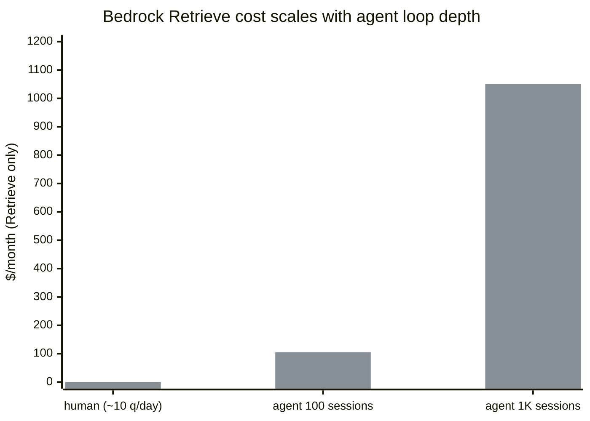

<h1 align="center">bedrock-tax</h1>

<i>Replacing OpenSearch Serverless with Aurora x pgvector to cut Bedrock Knowledge Base costs from $700/mo → $50/mo</i>

[![Github][github]][github-url]

 

## Table of Contents

<ol>
    <a href="#problem">Problem</a> 
    <a href="#hidden-constraint">Hidden constraint</a> 
    <a href="#approach">Approach</a> 
    <a href="#agent-era-context">Agent-era context</a> 
    <a href="#embedding-strategy">Embedding strategy</a> 
    <a href="#query-pattern">Query pattern</a> 
</ol>

 

## Problem

Our AI agent (used for speeding up oncall triage work) was querying a **AWS Bedrock Knowledge Base** (backed by **AWS OpenSearch Serverless**):
- OpenSearch Serverless requires min **2 OCU** (OpenSearch Compute Units) [quote](https://aws.amazon.com/opensearch-service/pricing/)
- billed at **$350/OCU/month** [quote](https://aws.amazon.com/opensearch-service/pricing/)
- result → a flat **$700/month floor** *regardless of actual query volume*

The KB served **~8,800 documents** across three domains:
- documentation:  **~7,700** chunks
- compliance rules: **~1,100** rules
- code repo metadata: **~5,600** chunks

Realizing the issue:
- AI agent's underlying Bedrock model was Claude 3.5 Haiku (`claude-3-5-haiku-20241022`), which accessed the Knowledge Base thru the `Bedrock Retrieve API` at **$0.00035 per query** [quote](https://aws.amazon.com/bedrock/pricing/)
- at human query volumes this per-query cost was negligible- the $700 floor dominated the bill

But agent traffic is **NOT** human traffic:
- a human triaging a ticket may search the KB **~5 times/hr** → skim results → move on
- the agent doing the same triage blasts the KB **20+ times/5 sec**- every tool call, often further fanning out into parallel crosswalk lookups across docs, security rules, commit history
- a busy oncall week with just **1,000 agent sessions** = **100,000 queries** = **$35/day** in Retrieve fees alone- *on top of the $700 floor(!)*

## Hidden constraint

Bedrock Knowledge Base presents as a single managed service: 
> ingest docs → call `RetrieveCommand` → results

But under the hood, it decomposes into two meters that are actually **decoupled**:

| | Meter | What | Cost ($) | | Alternative |
|---|---|---|---|---|---|
|  | Vector store (backend) | OpenSearch Serverless| $700/mo floor | → | Swap backend (Aurora pgvector), keep interface (`Bedrock Retrieve API`) |
|  | Retrieval interface | `Bedrock Retrieve API` | $0.00035 x query [quote](https://aws.amazon.com/bedrock/pricing/) | → | Query backend (vector store) directly via raw SQL |

**Core insight**: cost floor was attached to the backend (vector store), *not to the retrieval interface*

## Approach

| | Step | Date | Changes | Cost impact | % saved |
|---|------|------|-------------|-------------|---------|
|  | 1 | 2025-12-31 | <ul><li>Swap backend, keep interface</li><li>OpenSearch Serverless → Aurora pgvector</li><li>app still calls `RetrieveCommand`</li></ul> | $700/mo → $50/mo | +93% |
|  | 2 | 2026-01-29 | <ul><li>Drop interface to fully bypass KB</li><li>delete KB</li><li>app embeds via Titan, queries Aurora via RDS Data API</li></ul> | $0.00035/q Retrieve [quote](https://aws.amazon.com/bedrock/pricing/) → $0 Retrieve | +100% |

**Migration path**:
> each step is independent + can be validated before proceeding:

**Step 0**:
- Bedrock KB on OpenSearch Serverless (~$700/mo)
- Agent + S3 docs → `Retrieve API` → OpenSearch

**Step 1**:
- kept Bedrock KB `Retrieve API` intact- same application code, same KB config, different storage backend
- Aurora Serverless v2 runs at **~$50/month** and **scales to zero ACU on idle** [quote](https://docs.aws.amazon.com/AmazonRDS/latest/AuroraUserGuide/aurora-serverless-v2-auto-pause.html)
- the OpenSearch Serverless floor disappeared immediately
- see [`migrations/01_swap_store.sql`](migrations/01_swap_store.sql)

**Step 2**:
- fully deleted Bedrock KB + dropped `RetrieveCommand` from the path
- the application embeds the query using Titan v2 (`amazon.titan-embed-text-v2:0`) → sends embedding as a SQL param → then runs a cosine distance query against Aurora via `ExecuteStatementCommand` (RDS Data API)
- see [`migrations/02_kill_wrapper.sql`](migrations/02_kill_wrapper.sql)

**Figures**:
- one-time embedding cost for all ~8,800 rows: **~$0.20** via Titan v2
- per-query **retrieval** cost after step 2: **$0** (meter gone- you no longer call it)
- left: Titan query embed (**~$0.00002/1K tok**) [quote](https://aws.amazon.com/bedrock/pricing/) + the ~$50/mo Aurora floor

## Agent-era context

Bedrock's `Retrieve API` at $0.00035/query [quote](https://aws.amazon.com/bedrock/pricing/) is priced for human access patterns- a few queries per session, a few sessions per day

Agent traffic operates differently: a single agent session doing RAG against the KB generates retrieval calls at every turn, often multiple per turn:

| Caller | Queries/day | Retrieval cost/day | Retrieval cost/mo |
|--------|-------------|-------------------|-----------------|
| human | ~10 | $0.004 | $0.11 |
| agent (20-turn × 5 KB hits × 100 sessions) | 10,000 | $3.50 | $105 |
| agent (20-turn × 5 KB hits × 1,000 sessions) | 100,000 | $35.00 | $1,050 |

Before step 1, the $700 OpenSearch floor dominated total cost + made the per-query fee invisible
After step 1 eliminated the floor, the per-query cost became primary line item and **scaled with agent loop depth rather than user count**
This is what motivated step 2.

<!-- BADGES -->
[github]: https://img.shields.io/badge/bedrock--tax-000000?style=for-the-badge&logo=github&logoColor=white
[github-url]: https://github.com/vdutts7/bedrock-tax

